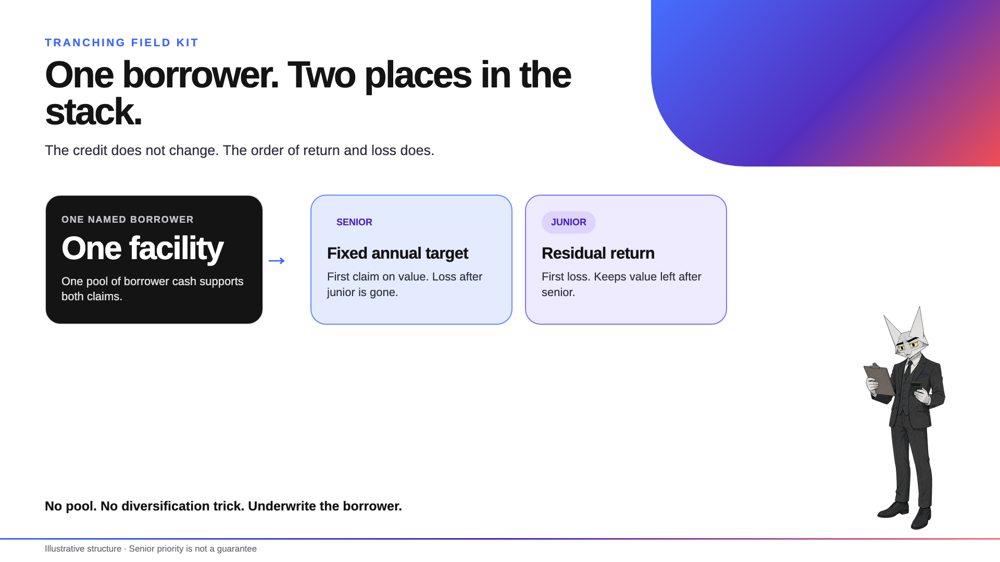
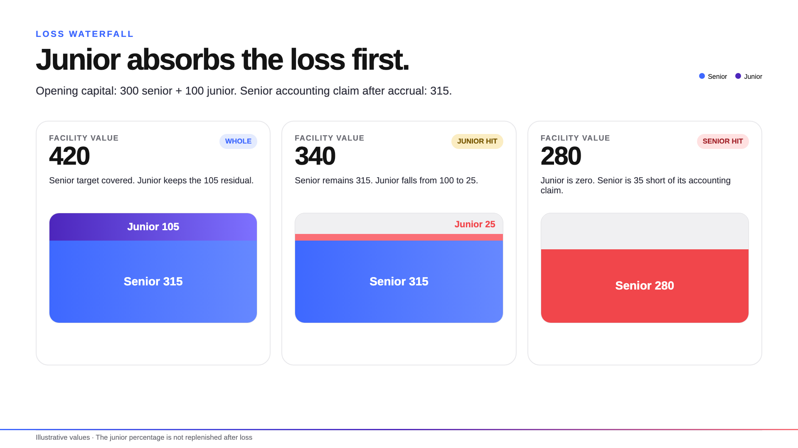

# Wildcat tranching



**One borrower. One facility. Two attachment points.**

Senior gets funded first-loss capital beneath it and a fixed annual target. Junior takes the first hit and
owns the value left after senior. The borrower brings both cheques into one Wildcat market.

[See the $20m Acme example](docs/bd/ACME_WORKED_EXAMPLE.md) ·
[Open the BD field kit](docs/bd/README.md) ·
[Read the architecture](docs/ARCHITECTURE.md)

## The product

| Senior | Junior | Borrower |
| --- | --- | --- |
| Priority on facility value | First-loss capital | One underlying credit |
| Fixed annual accounting target | Residual after senior | One capital stack |
| Exit requests clear before junior | Exit requests clear after senior | Opening tranche terms set at formation |

Both classes own the same borrower risk. The structure changes attachment, cash priority and return. It
does not manufacture diversification or turn poor credit into good credit.



## What ships here

| Contract | Job |
| --- | --- |
| `TrancheFactory` | Deterministic deployment and binding checks |
| `TrancheManager` | Per-market custody, accounting, waterfall and settlement |
| `TrancheOpenTermHooks` | Singleton admission and the exact market-close checkpoint |
| `TrancheToken` | Senior and junior participation tokens |
| `WaterfallMath` | Senior target, junior residual and subordination maths |

The manager is the only economic lender to the underlying market. It holds the canonical wrapped market
position; tranche holders hold senior or junior claims rather than market tokens or wrapper shares.

## Behaviour that matters

- **One market, one manager:** no competing tranche set can claim the same recovery.
- **Junior loses first:** senior is a priority claim, not a guarantee.
- **Cash follows the borrower:** exits use the underlying withdrawal queue and may settle in pieces.
- **Senior requests clear first:** FIFO applies inside each class. Distress also reserves cash for live
  senior claims.
- **Entry can be open or controlled:** a gate may refuse new exposure, but cannot stop an existing holder
  from requesting exit or claiming cash.
- **Sanctions do not rewrite the waterfall:** holder proceeds use the canonical escrow path where required.
- **Wind-down is one way:** market close or an observed arrears threshold freezes new entry and senior
  accrual while exits and recovery continue.
- **The end state is fixed:** final surplus goes only to the immutable term recipient after holders,
  custody and senior reserves are clear.

The detailed accounting and edge cases are in the
[trancher logic report](docs/TRANCHER_LOGIC_REPORT.md). Trust boundaries and contract relationships are in
the [architecture](docs/ARCHITECTURE.md).

## Run it

```sh
git submodule update --init --recursive
cd build
forge test --no-match-path test/Fork.t.sol
```

The fork suite uses the V2.5 code pinned at
[`e88e799`](https://github.com/wildcat-finance/v2-protocol/commit/e88e799) and mainnet block `25,758,381`:

```sh
cd build
forge test --match-path test/Fork.t.sol -vv
```

Set `MAINNET_RPC_URL` to replace the default RPC endpoint.

## Status

This repository is tested implementation work for the intended V2.5 integration. It includes local,
invariant and pinned-stack fork coverage; it is not a deployment candidate, live offer, completed audit or
claim of production readiness.

For the trade rather than the machinery, start with the [BD field kit](docs/bd/README.md).
