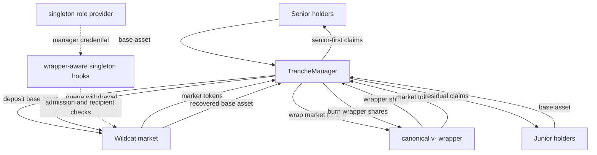

# Prototype Architecture

## Status

This document defines the prototype boundary implemented under `build/src`. The contracts import
the protocol types and implementations pinned by the `build/lib/v2-protocol` submodule at
`e88e799`, the head of PR #129 stacked on PR #124. Unit tests still use local doubles;
`build/test/Fork.t.sol`
deploys the pinned contracts on mainnet block `25,758,381`, verifies the complete market,
canonical wrapper and predicted manager deployment path, then deposits junior and senior capital
through the manager, queues both exits into one market batch and settles an initial shortfall before
the final recovery. That batch is delinquent at execution and retains accrued-interest residue in
the market after all tranche face is settled. This remains an engineering prototype.

The prototype targets Wildcat V2.5 and the sealed singleton role-provider hooks proposed in
[`v2-protocol#124`](https://github.com/wildcat-finance/v2-protocol/pull/124), with narrow close and
withdrawal-execution hook extensions in
[`v2-protocol#129`](https://github.com/wildcat-finance/v2-protocol/pull/129).
Supporting an earlier
V2 market without an equivalent immutable admission primitive is a separate design.

The real-stack proof covers one bounded delinquent shortfall and later repayment. Broader
delinquency, the terminal interest/dust rule and sanctions settlement remain hardening work, rather
than a claim that this is ready for deployment.

## Terms

| Term | Meaning |
|---|---|
| Market | One registered Wildcat market and its rebasing market token. |
| Wrapper | The canonical `Wildcat4626Wrapper` registered by `Wildcat4626WrapperFactory`; its shares are non-rebasing claims on market tokens. |
| Manager | One `TrancheManager` bound to one market and its canonical wrapper. |
| Senior / junior | The two manager-issued tranche tokens. |
| Singleton provider | The immutable pull role provider whose lender is the manager. |
| Wrapper-aware singleton hooks | The hook configuration that admits only the manager to deposit and lets only the canonical registered wrapper bypass the recipient-credential check. |

## Target topology



The wrapper is a custody adapter, not a second economic lender. The manager owns every wrapper
share. The wrapper holds the corresponding market-token backing. No tranche holder touches either
asset.

## Why the `SingletonOpenTermHooks` supply identity must change

The unwrapped `SingletonOpenTermHooks` design disables all market-token transfers and proves:

```text
scaledTotalSupply == scaledBalanceOf(singletonLender) + scaledPendingWithdrawals
```

That is incompatible with the canonical ERC-4626 wrapper:

1. `Wildcat4626WrapperFactory.createWrapper` currently rejects a market reported as
   transfer-disabled.
2. Wrapping calls `market.transferFrom(manager, wrapper, amount)`.
3. Unwrapping calls `market.transfer(wrapper, manager, amount)`.
4. The wrapper, not the manager, holds the active market-token balance after wrapping.

The wrapped `SingletonOpenTermHooks` supply identity should instead be:

```text
market.scaledTotalSupply
  == market.scaledBalanceOf(manager)
   + market.scaledBalanceOf(wrapper)
   + market.scaledPendingWithdrawals

wrapper.totalSupply == wrapper.balanceOf(manager)
wrapper.scaledBacking == wrapper.totalSupply
```

The manager balance is normally zero outside an executing deposit or redemption, but it remains in
the identity so intermediate custody is not misclassified. The final equality uses the wrapper's
scaled backing check rather than normalized `balanceOf`, avoiding rounding ambiguity.

## Market-token transfers

PR #124's requirement that the market report all transfers disabled should be removed. Adding a
new transfer mode or encoding bespoke caller/from/to edges is unnecessary. The existing singleton
recipient check remains the policy:

1. transfer-hook dispatch and access checks remain required;
2. if `to == market.registeredWrapper()` and the registered wrapper is nonzero, allow the transfer;
3. otherwise require the recipient to hold the singleton lender credential exactly as today.

Wrapping succeeds because the canonical wrapper is the recipient. Unwrapping succeeds because the
manager is the recipient and holds the sole credential. Every other recipient remains subject to
the existing singleton restriction. The wrapper address is read live from the market, so the market
can be created before its wrapper. Only the canonical wrapper factory can register that address.

Deposits remain stricter: only the manager receives a live singleton credential. Registering the
wrapper does not make it an admitted depositor. The manager should grant only exact, short-lived
allowances needed by the canonical wrapper and expose no arbitrary transfer or approval surface.

## Contracts and responsibilities

### `TrancheFactory`

Target behavior:

- immutable and ownerless;
- knows the canonical ArchController and wrapper factory;
- deploys fixed `TrancheManager` runtime code with CREATE2;
- exposes `computeManagerAddress(deployer, salt)` independent of market parameters;
- namespaces salts by the calling borrower wallet;
- initializes the new manager in the same transaction as deployment;
- verifies the market, wrapper, singleton hook and provider bindings before registration;
- verifies through the market's `HooksFactory` that the hooks instance came from the pinned
  singleton template;
- records one current manager per market and an append-only deployment history;
- permanently rejects a second manager for the same market.

Address prediction must not depend on a wrapper address that does not exist yet. The simplest
non-proxy construction is a manager with constant constructor code and a factory-only, one-time
`initialize` call. Market and wrapper addresses live in storage, but initialization is atomic,
factory-only and permanently closed. There is no delegatecall, implementation pointer or upgrade
path.

### `TrancheManager`

Target behavior:

- binds one market, canonical wrapper and base asset; sanctions calls resolve the market's registered
  borrower principal at execution time; the factory verifies the hooks instance, provider and
  sanctions sentinel;
- deploys or receives the two tranche-token addresses during initialization;
- accepts the base asset from an eligible user;
- deposits it into the market as the singleton lender;
- wraps every market token received and retains every wrapper share;
- maintains senior obligation, junior residual and subordination accounting;
- burns tranche shares into immutable async withdrawal requests;
- redeems wrapper shares, queues market withdrawals and accounts for partial recovery;
- allocates recovery senior-first; the pinned execution hook records each withdrawal expiry and
  reserves only that batch's excess against live senior debt during distress, independently of the
  transaction caller;
- routes sanctioned claims to the canonical escrow path;
- defers a market withdrawal while the manager itself is sanctioned, so the market cannot consume
  an expiry-bearing batch into an escrow release with no batch provenance;
- contains no arbitrary-call, arbitrary-transfer or upgrade function.

The strict singleton prototype should expose only a base-asset deposit front door. Accepting market
tokens or wrapper shares from users would imply that those users had acquired assets the singleton
boundary says only the manager may own.

### `TrancheToken`

- one immutable manager;
- manager-only mint and burn;
- EIP-2612 permit if retained from Solady;
- incoming-transfer eligibility check delegated to the manager or immutable entry gate;
- mint and burn bypass entry checks so redemption cannot be trapped;
- value views are clearly documented as views, not a claim of synchronous ERC-4626 behavior.

### Wrapper-aware singleton hooks

This may live in the singleton repository or as a tranching-specific template built on its sealed
provider primitive. It must:

- create and seal one singleton provider for the predicted manager;
- require deposit and transfer hook dispatch at market creation;
- stop requiring the market to report `transfersDisabled == true`;
- allow a nonzero `market.registeredWrapper()` as a transfer recipient before applying the normal
  singleton recipient-credential check;
- preserve the existing restriction for every other recipient, without adding a transfer-mode enum;
- prevent later provider mutation and keep transfer-hook dispatch and access checks enabled;
- remain usable before the wrapper exists, so a Safe can create the market and wrapper in one batch
  and an EOA can do so in consecutive transactions.

## Trust boundaries

| Actor | Powers | Must not be able to do |
|---|---|---|
| Borrower wallet | create the market; select immutable tranche terms; borrow/repay under Wildcat rules | admit another market lender or redirect manager custody |
| Entry gate owner | change who may acquire a tranche, if a mutable gate is selected | block burns or claims |
| Keeper / any account | checkpoint, execute expired withdrawals, synchronize recovery and claim for an owner | select the claim recipient or alter allocation |
| Wrapper factory | deploy and register the canonical wrapper | choose a manager or tranche terms |

## Core invariants

The implementation and tests should state these directly:

1. `manager.market()` and `manager.wrapper().market()` are the same registered market.
2. `wrapperFactory.wrapperForMarket(market) == manager.wrapper()`.
3. The market hook and provider are sealed, with transfer-hook dispatch and access checks enabled.
4. `provider.lender() == manager`.
5. Active market-token supply is held only by manager, wrapper or pending withdrawals.
6. All wrapper shares are held by the manager.
7. Senior value plus junior value equals the manager's marked value; live delinquency appreciation
   above that mark remains excluded until cure.
8. Junior absorbs loss before senior.
9. No senior deposit or active-state junior exit can violate minimum subordination.
10. Allocated recovery never exceeds recovered base assets.
11. Allocatable recovery plus the tagged senior-debt reserve and terminal recovery surplus equals
    cumulative observed recovery.
12. A request synchronises recovery before adding face, can never claim more than its class FIFO
    entitlement and cannot consume recovery which arrived before its face existed. Recovery admitted
    solely against live distressed senior debt can migrate only into senior replacement face and is
    retired on cure or when an impaired exit extinguishes more debt than it queues. A generic late
    balance sync cannot create that reserve. A market execution admits recovery only against face
    recorded for its exact expiry, so an older batch cannot fund a later request. Unattributed base
    asset is terminal surplus and does not fund any queue face.
13. During distress, junior cannot receive assets while the senior obligation is uncovered.
14. No entry gate or sanctions path can prevent a holder from burning shares and creating an exit
    request.
15. A sanctioned claim changes the destination to escrow, not the amount or queue position.
16. A manager cannot be initialized twice or rebound to another market.

## Prototype accounting choice

Senior accrues at the fixed annual rate stored during initialisation. The manager never reads the
market's mutable APR for tranche accounting, so a market-rate change cannot reprice the senior
claim. Interest is simple interest on outstanding senior principal, with fractional carry between
checkpoints. Deposits, exits and recovery execution checkpoint first. The fixed rate has no setter.

While the market is healthy, the manager checkpoints aggregate wrapper value. During delinquency,
valuation is the lower of live value and that aggregate mark. Each exit converts its class
entitlement down to whole wrapper shares, records their floor-normalised value as request face and
reduces the mark by that backed face. Wrapper redemption and market queueing move those same scaled
units, so an earlier FIFO request cannot claim backing supplied by a later one. Live appreciation
above the mark stays wrapped until cure; live loss is recognised immediately. If nobody called the
manager immediately before
delinquency, healthy appreciation since the previous checkpoint is excluded until cure. Capturing
the exact transition would need a protocol callback. Market closure is exact: the pinned
`TrancheOpenTermHooks` checkpoints the manager during `closeMarket`.

## Explicit non-goals for the first prototype

- retrofitting facility-wide seniority onto a market that still has direct lenders;
- more than two tranches;
- markets whose asset uses fewer than six decimals;
- multiple active managers for one market;
- manager upgrades or migration of live positions;
- secondary-market liquidity guarantees;
- accepting market tokens or wrapper shares from tranche users;
- cross-market diversification inside one manager;
- declaring the prototype audited, production-ready or legally sufficient.
