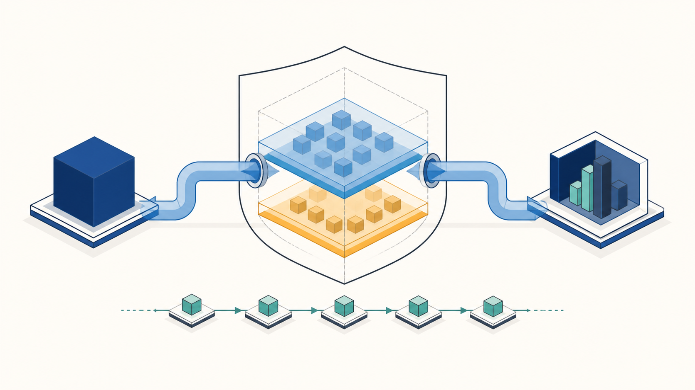
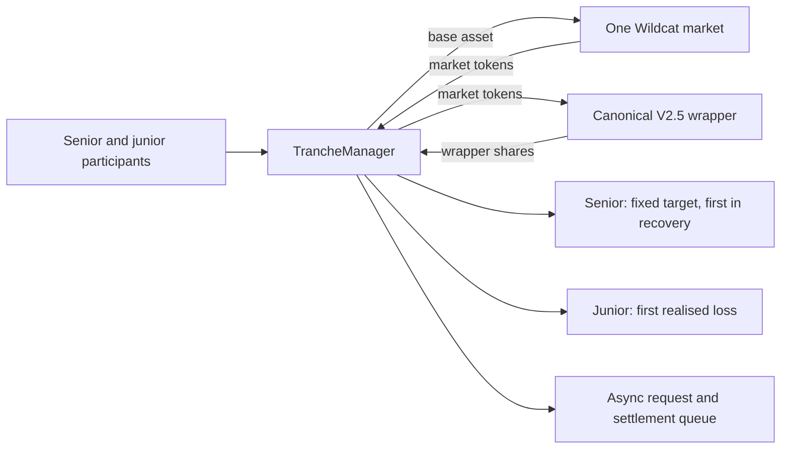

# Wildcat tranching: prototype handoff

The picture is deliberately simple. Base-asset capital enters the `TrancheManager`, which deposits
into one Wildcat market and wraps the resulting market tokens in the canonical wrapper. The manager
holds that wrapper position and issues two separate participation claims: senior and junior. It does
not create a second loan, move the borrower relationship, or offer instant redemptions.

## What is working in the prototype

- One manager is the sole credentialled market lender. The factory verifies the market, wrapper,
  hooks and provider before it creates that manager.
- Deposits use the market and its registered wrapper; there is no side pool of market tokens or
  an arbitrary asset-transfer path.
- The senior claim accrues at the facility’s fixed target while the manager remains Active,
  including the configured delinquency window, then freezes at wind-down or market closure.
  Realised losses reduce junior value before senior value.
- Exits follow the market’s withdrawal batches. Recovery is attributed to the batch that produced
  it, then assigned senior-first and FIFO within each class.
- Entry can be restricted independently for senior and junior. A later gate decision cannot stop a
  holder requesting redemption or claiming an already-earned recovery.
- The real V2.5 fork covers the wrapper, singleton admission, shortfall, sanctions escrow and
  manager-sanction retry paths.

## What it is not

This is not a production offering, a credit guarantee, a liquidity promise or an underwriting
engine. It does not make a borrower safer, turn an illiquid loan into a liquid instrument, or
replace legal analysis of the offering. The market’s own protocol fee, sanctions handling and
withdrawal mechanics still apply.

The accompanying [outreach primer](TRADFI_OUTREACH_PRIMER.md) is for first conversations. The
[release evidence](RELEASE_EVIDENCE.md) says what ran. The
[V2.5 assessment](V25_AUDIT_BUNDLE_ASSESSMENT.md) says what the audit bundle must include before
this prototype can sit on that stack.
