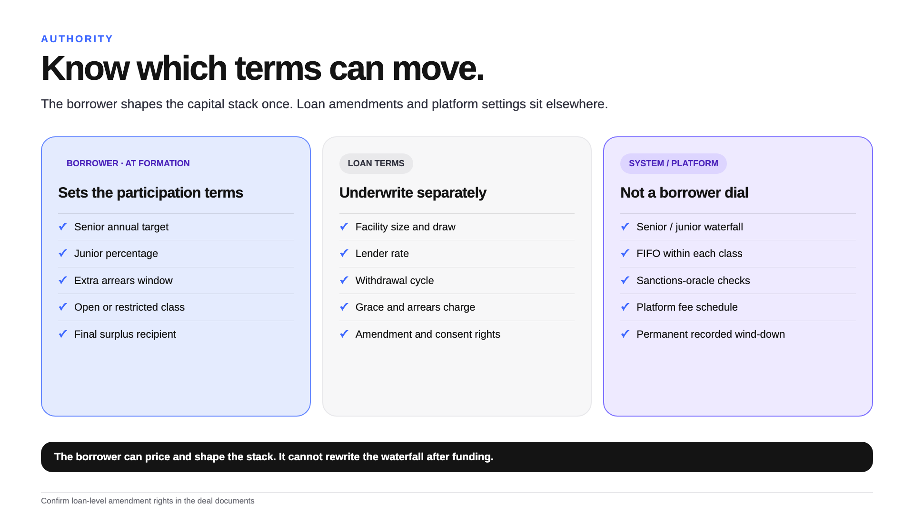
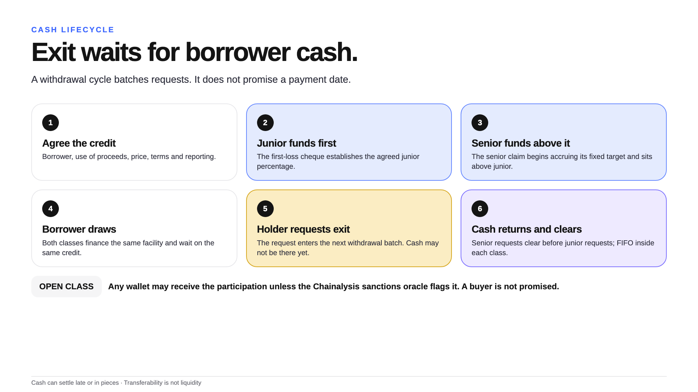
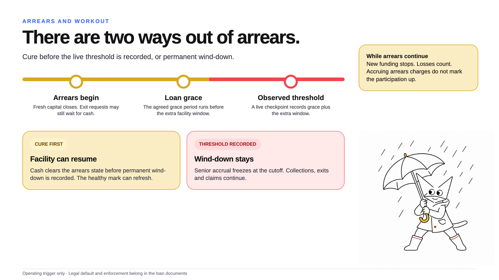
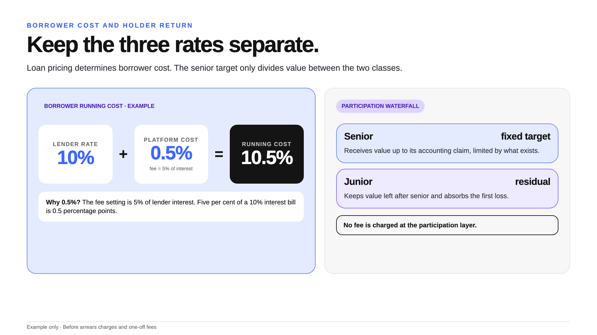

# Deal diagrams

Six screen-ready pictures. Keep each caption with its image.

## One loan, two claims

Use this first. Both classes own the same borrower credit. Senior has a fixed accounting target; junior
takes the first loss and keeps the residual.

## Loss waterfall

Use this before discussing yield. The junior percentage is not rebuilt after loss.

## Who sets what

The borrower shapes the capital stack at formation. Loan amendments and platform settings remain separate.

## Cash lifecycle

The withdrawal cycle batches an exit request. Payment still waits for borrower cash. For an open class,
any wallet may receive the participation unless the Chainalysis sanctions oracle flags it.

## Arrears and workout

Cure must happen before the live threshold is recorded. Once recorded, wind-down stays and senior accrual
freezes at the cutoff.

## Borrower cost and holder return

A 5% platform fee means 5% of the interest bill, not five percentage points of principal. The senior target
is another number again: it divides value between the two classes. No fee is charged at the participation
layer.

## Use rules

- Keep the qualification with the picture.
- Treat every number as an illustration until a live credit is approved.
- Do not promise repayment, liquidity, rating or legal treatment.
- Use the [field-kit visual rules](BRAND_AND_VISUALS.md) for any new image.
- Send implementation questions to the [internal research report](RESEARCH_REPORT.md).

These diagrams describe the current prototype. They are not a rating, audit opinion or product approval.
