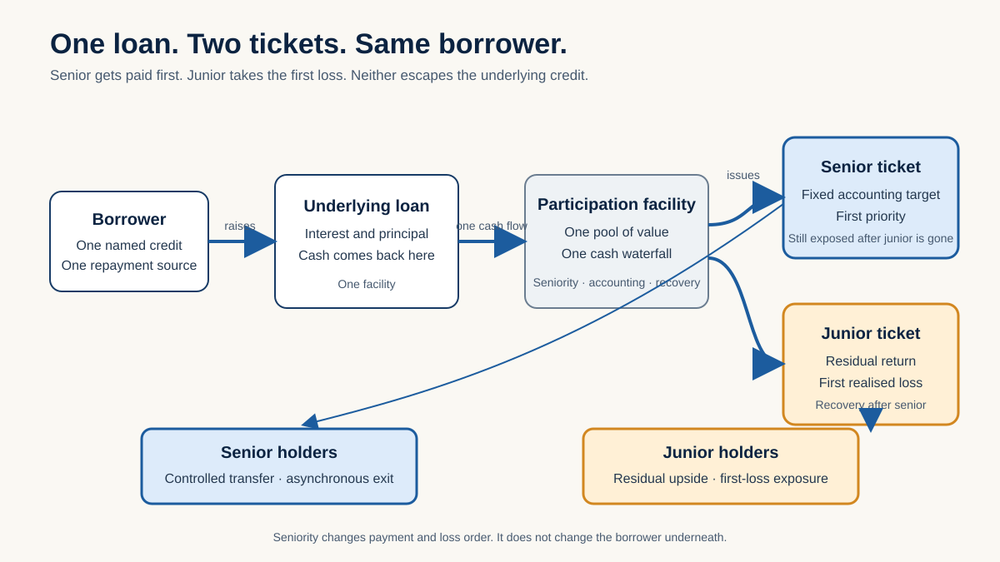
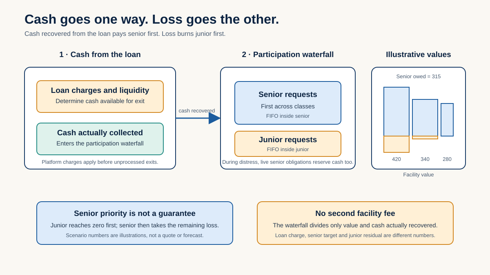
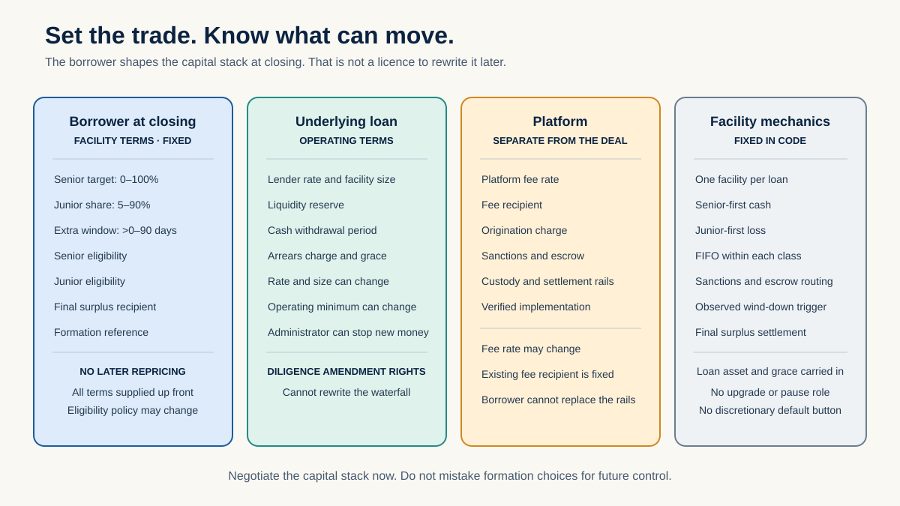
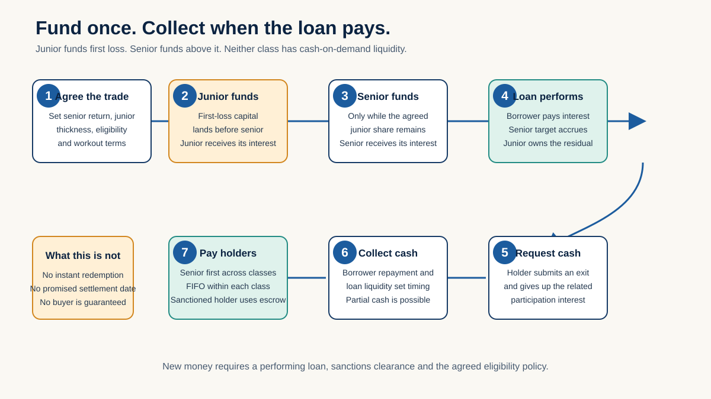
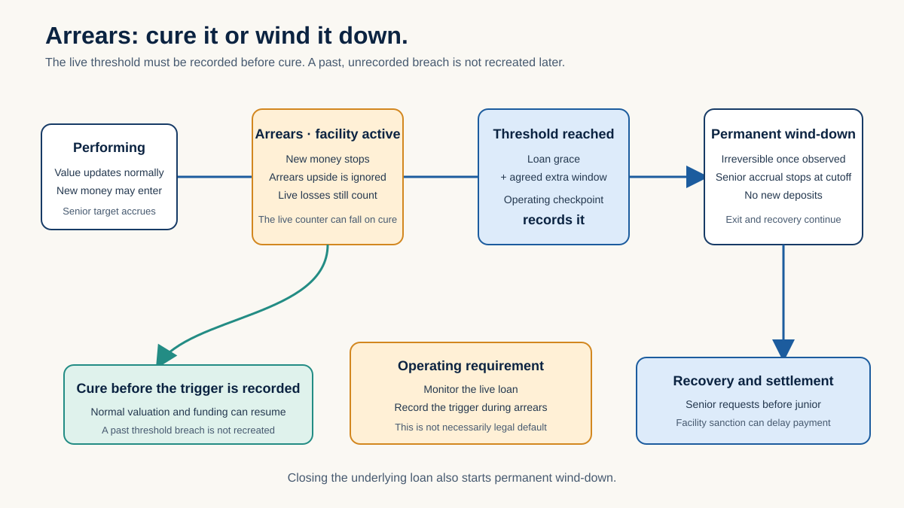
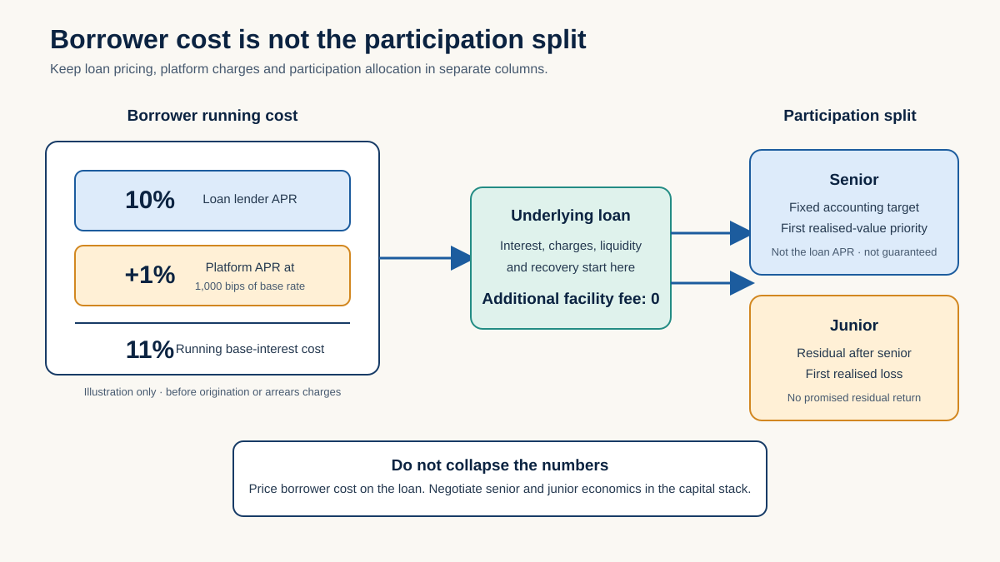

# Deal diagrams

Six pictures. One trade. Keep the captions attached so nobody sells priority as a guarantee or
transferability as liquidity.

## One loan, two tickets

Same credit. Senior gets paid first. Junior takes the first loss and keeps the residual.

## Where the money goes

Use this for the three cases that matter: whole, junior impaired and senior impaired.

## Who controls what

The borrower shapes the deal at formation. That does not mean the borrower can rewrite it later.

## Cash in, cash out

There is no instant exit. Cash comes out when the loan produces it.

## Arrears and workout

Use this to agree who watches the credit, who records the trigger and who runs the workout.

## Borrower cost versus holder return

The borrower rate, platform charge and senior target are three different numbers. Keep them that way.

## Reuse rules

- Keep the qualification with the picture.
- Treat every number as an illustration until a live credit is approved.
- Never promise repayment, liquidity, rating or legal treatment.
- Send implementation questions to the [internal research report](RESEARCH_REPORT.md).

## Verification record

- Six of six SVG files parse as XML, contain a title and description, contain no script or external
  resource link, and render successfully at 1200 by 675.
- The full contact sheet was inspected after the credit-desk rewrite; no clipped or overlapping copy
  remains.
- All local links in the outward BD pack resolve.
- Proscribed and Imprimatur report zero defects across the outward BD pack.
- `forge fmt --check` passed.
- The selected local suites passed: 52 unit tests, five fuzz tests at 256 runs each, one view-property
  test and one release-evidence test. Foundry printed the pinned SphereX `locals` diagnostic but returned
  success for every suite.
- Seven of seven pinned fork tests passed. The same non-fatal SphereX diagnostic appeared.
- Four stateful properties passed their configured 256 runs and 128,000 calls each. The full-depth
  claims property was terminated by this host before a verdict; it passed 256 runs and 25,600 calls at
  depth 100. This is recorded as a reduced-depth result, not a full configured invariant pass.
