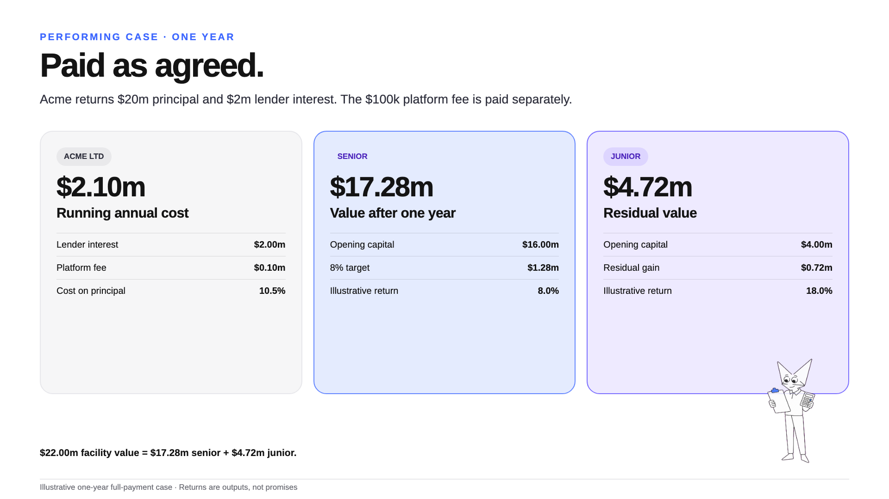

# Stop asking every lender to buy the same risk.

One borrower. One facility. Two attachment points.

Senior gets funded first-loss capital beneath it and a fixed annual target. Junior takes the first hit and
owns the value left after senior. The borrower brings both cheques into one financing.

## Pick your seat

| Senior | Junior | Borrower |
| --- | --- | --- |
| Own the named credit above funded junior capital | Take first loss for the residual after senior | Build one stack around two pools of capital |
| Priority on facility value | Upside when the credit clears above senior's target | Set the opening senior target, junior percentage and workout window |
| Cash exit before junior requests | First-loss risk and cash exit after senior requests | One loan, one cashflow, one workout |

Same credit. Different price, loss and return.

## Put numbers on it

The [Acme worked credit](ACME_WORKED_EXAMPLE.md) starts with a $20m USDC line: $16m senior, $4m junior, a
10% lender rate and an 8% senior target.

In the paid-as-agreed case, senior reaches its 8% target and junior earns an illustrative 18%. The same
example shows a day-24 cure and a severe $12m recovery where junior goes to zero before senior is paid in
full.

That is the product. Price the borrower, choose the attachment and run the downside.

## Take what you need

- [Meeting brief](MEETING_BRIEF.md): open the call and get to credit.
- [Desk primer](PRIMER.md): return, loss, cash and workout.
- [Acme worked credit](ACME_WORKED_EXAMPLE.md): performing, cured and severe cases.
- [Deal diagrams](INFOGRAPHICS.md): eleven screen-ready pages.
- [Facility worksheet](PARAMETER_DISCOVERY.md): turn appetite into terms.
- [Desk FAQ](FAQ_AND_CLAIMS.md): answer the awkward questions without making things up.

## Keep it true

Both tickets own one borrower risk. Senior is priority, not a guarantee. Exit cash still depends on the
borrower paying. Open transfer means any wallet can receive unless the Chainalysis sanctions oracle flags
it; it does not promise a buyer or price.

This pack assumes the intended V2.5 integration lands as designed. The repository is tested implementation
work, not a live offer, rating, legal opinion or promise of liquidity. Detailed implementation notes live
in the [research report](RESEARCH_REPORT.md), where they belong.
