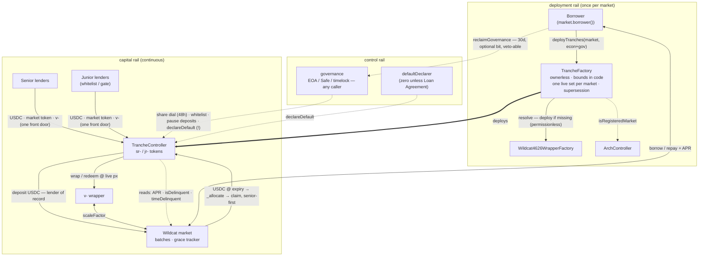

# Tranching Deployment & Governance — Design Notes

*How a tranche set comes into existence, who can create one, how capital enters, and what the governance role actually is. This document stands alone: the target design plus the decisions still open, in that order. None of it is implemented at `48cc01d` — the contracts there reflect an earlier deployment model (owner-gated factory, wrapper-share deposits). Companions: `Six-Seven-Mechanisms-Report.md` for the tranche mechanics, `Design-Risk-Specification.md` for the original rationale.*

---

## Decisions outstanding

Everything below the line is designed. These are the calls that still need an owner before it ships.

| # | Decision | What hangs on it | Owner |
|---|---|---|---|
| O1 | **Foundation sign-off on the deployment posture**: borrower-gated, ownerless factory, bounds in code | Blocks the factory build. The design exists because of the neutrality constraint (§1), but the Foundation should confirm the posture before it's cast in code | Foundation |
| O2 | **Governance holder per facility**: borrower Safe vs lender-side vs neutral third party | A borrower holding it controls both senior-rate dials and the un-timelocked wind-down trigger. That's legitimate, but senior buyers have to be told in those words. Lender-side governance sells senior more easily | Desk + borrower, per term sheet |
| O3 | **ToU / MLA papering for tranche-only buyers**: under the USDC front door (§2), buyers never touch the market's hooks, so market-level ToU acceptance never reaches them | Blocks shipping the USDC entry path. Does a tranche deposit constitute acceptance, or does the tranche layer need its own papering? The entry gates enforce whatever the answer is | Legal |
| O4 | **Governance-recovery bit per facility** (`borrowerRecovery` on/off at deploy) | The mechanism (§6) is built once and each facility chooses. I'd default it off: governance loss is a safe failure mode here, and an assurance-maximal facility should be able to point at the bit | Per-facility, at deploy |
| O5 | **Supersession policy**: one live controller per market, replacement only when the incumbent is empty or wound down, never concurrent | The mechanism argument in §4 only goes one way [concurrency breaks senior priority at the market layer], so this needs a policy nod rather than more analysis | Desk + Foundation |
| O6 | **Senior entry policy for the first facility** (which gate/provider set, if any) | Covered in the mechanisms report (§12 there). Listed here because the USDC front door makes the gates the only per-user compliance surface, not a nice-to-have | Desk + borrower |

Settled design, pending build — no decision left, just engineering: the slimmed factory (§1), the USDC front door (§2), the supersession mechanism (§4), the recovery mechanism (§6), declarer retirement (§6), and pinning three function names against deployed ABIs (the wrapper factory's registry getter, its deploy entrypoint, and the market's `borrower()` getter).

---

## 1. Deployment: the borrower brings up the whole stack in one transaction

**Who deploys:** the market's borrower, and only the borrower. `deployTranches(market, …)` is gated on `msg.sender == market.borrower()`.

**What one call does:** the factory checks the market is registered (`ArchController.isRegisteredMarket`), resolves the market's canonical ERC-4626 wrapper from the `Wildcat4626WrapperFactory` — and deploys it in the same transaction if it doesn't exist yet, which works because wrapper deployment is permissionless — then deploys the controller and both tranche tokens. One transaction, full stack, atomic. The rule that a market must have a 4626 wrapping facility before it can be tranched doesn't need checking; the factory just makes it true. The compose is idempotent, since the wrapper factory only ever allows one canonical wrapper per market.

**What the borrower supplies:** economics (`seniorShareBips`, `minJuniorBips`, `defaultPenaltyWindow`), the governance address, and the optional `defaultDeclarer`. Nothing else. The wrapper is resolved, the sentinel is canonical, the borrower address comes off the market, and the token metadata is derived from the market's own symbol (`"Senior Tranched <SYM>"` / `sr-<SYM>`, junior likewise). Every parameter removed is attack surface removed: nobody can supply a fake wrapper if nobody supplies a wrapper.

**Why the borrower and not the protocol:** Wildcat Labs and the Foundation are bound to neutrality, so they can't select or endorse an attachment point. A Foundation that deploys on borrower application with the parameters passed through verbatim is the borrower deploying with extra ceremony, plus the optics of an approval that was never given. And borrower-set terms aren't a deviation from the Wildcat model — they are the model. On a base market the borrower already sets every term lenders face: APR, capacity, reserve ratio, grace, withdrawal cycle, lender access. The subordination parameters are more terms of the same offer.

**Why lenders are fine with that:** one structural reason, one economic.

- *Structural:* neutrality lives in hard-coded bounds — `minJuniorBips` ∈ [5%, 90%], `defaultPenaltyWindow` ≤ 90 days, `seniorShareBips` ≤ 100% — plus the registration check and the wrapper resolution. There's no discretion anywhere in the factory, so it needs no owner at all. Squatting is impossible too: for any given market a single address in existence can deploy, and it's the one with the legal identity behind the facility.
- *Economic:* the subordination gate separates deployment from capital formation. A fresh tranche set can't take a unit of senior until junior — whitelisted, sophisticated, first-loss — has funded it to the floor. So the parameters are ratified by the first junior deposit. A badly parameterised set isn't a trap for anyone; it just sits there empty. The junior anchor is the de facto underwriter, which is who it should be.

## 2. Entry: one front door, the controller as lender of record

Depositors bring **USDC** (or the market token `abcUSDC`, or wrapper shares `v-abcUSDC` — three accepted assets, one valuation path) and receive senior or junior tranche tokens. For USDC, the controller deposits into the market itself as the **lender of record**, receives the market token, and wraps it into `v-` shares for its own custody. Raw `abcUSDC` skips the market deposit and goes straight through the wrapper. All tranche accounting runs on wrapper shares regardless of the door used.

This makes the controller one more lender among the market's lenders, with extensible functionality on top. That's less novel than it sounds, twice over:

- **The exit path already works this way.** The controller queues and executes withdrawals on the market directly (`queueWithdrawal` / `executeWithdrawal`), which are lender-of-record operations. Entering as a wrapper-user but exiting as a market lender was an asymmetry with no benefit; the front door completes the pattern rather than introducing it.
- **The 4626 wrapper is precedent for a pooled contract-lender.** The wrapper is a lender in the holder-of-claims sense: one address pooling market tokens for many users, trusted by the market's compliance model, re-enforcing the sanctions sentinel per user underneath. What it never does is call `market.deposit()` — it isn't a depositor of record and never clears the market's deposit hooks. The controller extends the proven pattern by one step, pooled holder to pooled depositor. The single new prerequisite: the borrower credentials the controller under their market's hooks policy, which slots naturally into the deployment ceremony since the borrower controls that policy and deploys the tranche set anyway. Miss the step and deposits revert loudly; nothing fails silently.

**Why the wrapper stays in the custody path** rather than the controller holding rebasing `abcUSDC` directly: the audited valuation core — the price-per-share watermark, the delinquency freeze, live-price redemption sizing — is written against wrapper shares, and reusing the audited wrapper was the single biggest de-risking call in the original spec. Direct custody is cleaner in the limit but it rewrites the valuation core against `scaleFactor` and reopens the audited surface, for a benefit no buyer can see. That's a v2 move, taken when a v2 exists for other reasons. If it ever lands, §1's wrapper precondition dissolves with it.

**Consequences to hold in view:**

- **The buyer base decouples from the market's access policy.** A USDC-only senior buyer never becomes a Wildcat market lender and is invisible to the market's hooks. That's the distribution feature, and the borrower consents to it by deploying — but it means market-level ToU/MLA acceptance never reaches these buyers. The papering moves to the tranche layer (O3), and the entry gates plus sentinel become the entire per-user compliance surface.
- **Market capacity applies at deposit like it would to any lender.** At `maxTotalSupply` a USDC deposit reverts, same wall a direct lender hits, surfaced with a clear error. In practice senior capacity is junior-gated by the subordination floor well before it's market-gated.
- **The sanctions posture carries over from the wrapper unchanged.** A pooled depositor has the same whole-pool exposure to address-level sanctioning as the pooled holder always had, which is precisely why the tranche layer re-enforces the sentinel per user, with escrow, underneath.

## 3. One live controller per market; replacement, never concurrency

Subordination is internal to a controller. At the market layer, two controllers on the same market are just two pari-passu lenders, and the market's withdrawal batches pay pro-rata across everyone queued. Under stress, controller A's *senior* would compete on equal footing with controller B's *junior* for the same batch cash — someone else's first-loss capital getting paid while your senior waits. "Senior on this facility" stops meaning one thing at that point, and that's the product's core claim gone. Concurrency also fragments junior capital (the scarce input) into thinner cushions, invites arbing two prices for one credit risk, and multiplies the token and integrator surface.

What is needed is a replacement path, because the risk parameters are immutable: a mis-set floor or renegotiated terms can only be fixed by redeploying. So: **supersession**. A borrower may deploy a replacement set for their market only when the incumbent is empty or wound down; the old set retires (deposits closed, exits live forever); the registry points at the current one. One live controller per market at all times, history preserved, and no pari-passu dilution, ever.

## 4. The governance role: capabilities, not an interface

The controller never calls into the governance address. The role is purely an originator of calls — one modifier, one require, no callbacks, and no funds ever flow to it, since this design has no fees. So there's no interface to implement. The requirement is behavioural: anything that can make arbitrary outbound calls to the controller, forever. An EOA, a Safe, a timelock contract or a DAO executor all qualify out of the box; anything that can't originate calls bricks the role. The two-step rotation screens for this once — a proposed successor has to call `acceptGovernance()` itself, so a call-incapable address never completes the handover — though it can't screen for ongoing liveness. A Safe that loses its owners after accepting still bricks, and no interface can test for that.

What the role holds:

| Power | Bounded by |
|---|---|
| `proposeSeniorShareBips` / cancel | ≤ 100% of the market APR, 48h timelock, execution permissionless |
| `setJuniorAllowed` | Entry-gating only; cannot touch existing holders |
| `setDepositsPaused` | Deposits only, never exits |
| `setDefaultDeclarer` | Non-zero, evented |
| **`declareDefault`** | **Nothing. Un-timelocked, irreversible, immediate wind-down.** |
| `proposeGovernance` | Two-step, non-zero |

The fifth row is the one that should drive holder selection: governance isn't just parameter-tuning, it includes a live, undelayed kill switch. A borrower holding governance is holding the wind-down button on their own facility, which is mostly self-harm — but a borrower-governance also controls both dials of the senior rate (base APR market-side, `seniorShareBips` tranche-side). Consistent with borrower-sets-terms, and it has to be disclosed to senior buyers in exactly those words (O2). An ERC-165 "governance-capable" marker was considered and adds nothing: EOAs can't answer it, and answering it says nothing about future liveness.

## 5. Governance recovery: a dead-man's switch with an incumbent veto, or nothing

Lost governance is currently stuck forever. Note first that this is a *safe* failure mode: the logic is immutable, the subordination floor is immutable, the senior share freezes at its last value, exits can never be gated, and the terminal default trigger fires with no governance at all. Frozen, not dangerous — so "no recovery path" is a defensible choice, and some facilities will prefer being able to say it.

For facilities that want recovery, one shape preserves both recoverability and non-ruggability:

- **`reclaimGovernance(next)`** — callable only by `market.borrower()` (read live, never a stored deployer address), starting a long timelock of roughly 30 days, loudly evented.
- **The incumbent governance can cancel with a single call at any time in the window.** The veto is the liveness oracle. Dead governance can't veto, so recovery completes; live governance vetoes in one transaction, so takeover against a functioning holder is impossible. The recovery path stays strictly weaker than the role it recovers.
- Completion still runs through the standard two-step, so governance can't be reclaimed onto a call-incapable address either.

A standing borrower power to replace governance directly is rejected outright: it makes the borrower the real governance with extra steps, and any lender-side governance named as a selling point becomes revocable at the exact moment it matters. So the recovery path's existence is a per-deployment bit (`borrowerRecovery`), immutable after deploy, readable on-chain, priced by buyers (O4).

One adjacent fix while in this part of the code: `setDefaultDeclarer` rejects the zero address, so a declarer can be appointed but never retired back to the pure Terms-of-Use trigger. A deliberate zero path (or `clearDefaultDeclarer()`) makes the discretion removable. One-way doors should point toward less discretion, not more.

## The map

Solid = assets, dashed = control/reads.

---

*The engineering that falls out of this document — the slimmed borrower-gated factory, the wrapper compose, the USDC front door, the recovery mechanism, declarer retirement — sits in one pre-deployment PR alongside the derived token metadata, the entry-gate pointers and `claimMany` (see the build sheet). The USDC front door ships only once O3 has a legal answer, since under it the entry gates are the only per-user policy a buyer ever meets.*
