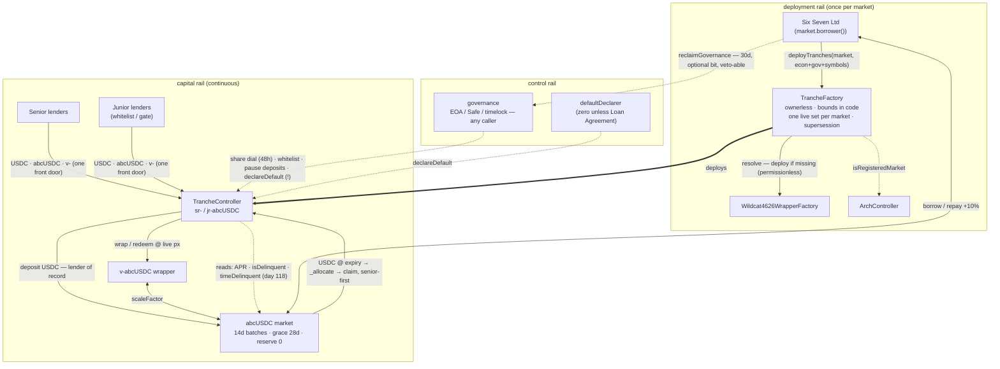

# Deployment, Access & Governance — Working Notes

*Informal notes from the abcUSDC design iteration, written down before they evaporate. This covers four questions the desk raised in sequence: can the factory require a 4626 wrapper, can deposits auto-wrap, who actually deploys a tranche set, and what the governance role really is. None of this is implemented yet — it's the shape we'd build, with the decisions flagged at the end. Code references are to `build/src/` at `48cc01d`.*

---

## 1. The wrapper becomes a precondition, and the factory stops trusting its caller

Today `deployTranches` takes `underlyingVault` as a parameter and *derives* the market from it (`vault.market()`). The fake-vault vector this opens is closed only by the owner gate — that was the SR-B fix, and it works by trust rather than by structure.

Invert it. `deployTranches(market, …)` and the factory **resolves** the wrapper itself:

- Hold an immutable reference to the `Wildcat4626WrapperFactory` and look up its market → wrapper registry (one canonical wrapper per market, same shape as our own `controllerForMarket`). If the deployed factory turns out to expose only an `isWrapper()` check or a deterministic deploy address rather than a mapping getter, the fallback is accepting the wrapper address but requiring `wrapperFactory.isWrapper(w) && w.market() == market`. *(Five-minute check against the real ABI still owed.)*
- `require(wrapper != address(0), "NO_WRAPPER")` — which is exactly the invariant asked for: **no 4626 facility, no tranche set.**
- `underlyingVault` leaves `DeployParams` entirely. One fewer trusted input; the fake-vault class dies structurally instead of by owner discipline.

Settled (desk confirmed): the wrapper factory's deployment **is permissionless**, so `deployTranches` composes it — resolve the wrapper, deploy it if missing, then deploy the tranche set, all in one transaction. The "no wrapper, no tranche set" invariant becomes self-satisfying rather than a sequencing rule, and the borrower's single `deployTranches(market, …)` call brings up the whole stack atomically: wrapper (if absent) + controller + both tranche tokens. Since the wrapper factory enforces one canonical wrapper per market, the compose is idempotent — deploying against a market that already has its wrapper just resolves it. The outstanding ABI check narrows to pinning exact function names (the registry getter and the deploy entrypoint), not permissioning.

While we're removing trusted inputs: `sentinel` shouldn't be caller-supplied either (resolve the canonical one), and `borrower` stops being a parameter because it's derived from the market. `DeployParams` shrinks to economics + governance + declarer + token symbols.

## 2. One front door: the controller becomes the lender of record

*(This section was first drafted as "auto-wrap `abcUSDC`, decline raw USDC." The desk pushed back on the decline, and the pushback wins — recorded here as reversed.)*

The winning observation is that **the exit path already treats the controller as a market lender**: `requestRedeem` unwraps and the controller itself calls `queueWithdrawal` / `executeWithdrawal` — lender-of-record operations. The current design enters as a wrapper-user and exits as a market lender; that asymmetry is the inelegant part, and taking USDC at the front door removes it rather than adding novelty.

On "isn't the 4626 wrapper already a lender into the market?" — yes, with one precision that is the whole implementation question. The wrapper is a lender in the **holder-of-claims** sense: one address pooling market tokens for many users, trusted by the market's compliance model, re-enforcing the sentinel per user underneath. It is *not* a lender in the **depositor-of-record** sense — it never calls `market.deposit()`; it receives already-minted `abcUSDC` by transfer and so never clears the market's deposit hooks. The controller-as-lender design extends the proven pattern exactly one step: pooled holder → pooled depositor. The market-side prerequisite is that the controller must be credentialed under the market's hooks policy — trivial in the borrower-deploys world, since the borrower controls that policy and deploys the tranche set; it's one more step in the same ceremony.

Two variants, sequenced:

- **Variant B — adopt now: USDC front door, wrapper retained internally.** Controller pulls USDC → `market.deposit()` as lender of record → wraps the minted `abcUSDC` into `v-` for itself → all existing share-based accounting runs unchanged (`markPps`, the high-watermark freeze, SR-D live-price sizing — none of it moves, because it keys off wrapper shares the controller still holds). Three accepted entry assets — USDC / `abcUSDC` / `v-` — one valuation path, USDC in and USDC out. Small diff, whole product win.
- **Variant A — defer to v2: drop the wrapper, hold rebasing `abcUSDC` directly.** The full "single location" version, cleaner in the limit — but it rewrites the valuation core against `scaleFactor` directly (watermark freeze, redemption sizing, and the SR-D bug class all re-derive in new denominations), reopening the audited surface for a benefit buyers can't see. Q1's reuse-the-audited-wrapper call was the biggest de-risking decision in the spec; spend it only when a v2 exists anyway. *(If A ever lands, §1's wrapper precondition dissolves with it.)*

Consequences of B worth stating plainly:

- **The buyer base decouples from the market's access policy.** A USDC-only senior buyer never touches the market's hooks and never becomes a Wildcat market lender. That is the distribution feature — and the borrower consents to it by deploying. But it means the market's per-lender ToU/MLA acceptance no longer reaches tranche buyers; the papering has to happen at the tranche layer. Legal question, not code (D9).
- **The `IEnterGate` work is promoted from hygiene to load-bearing.** With end users invisible to the market's hooks, the tranche gates plus sentinel *are* the entire per-user compliance surface.
- **The `maxTotalSupply` objection from the first draft is withdrawn** — the capacity constraint exists wherever the deposit happens; a lender minting `abcUSDC` directly hits the same wall. One require with a good error message, and senior capacity is junior-gated before it's market-gated anyway.
- **Sanction-nuke posture is unchanged precedent.** A pooled depositor has the same whole-pool exposure to address-level sanctioning as the pooled holder (the wrapper) always had; that's the Q14 rationale for re-enforcing per-user at the pool layer, and it carries over as-is.

## 3. Who deploys: the borrower, inside code bounds — and the factory can lose its owner entirely

The current answer is "the factory owner" (Wildcat ops), which was the SR-B fix. It doesn't survive contact with the constitutional structure: **Labs and the Foundation are bound to neutrality.** They can't select or endorse an attachment point. A Foundation that deploys on borrower application, parameters passed through verbatim, is the borrower deploying with extra ceremony — plus the optics of having "approved" numbers it explicitly does not vet. Worst of both. Dropped.

And the objection to borrower-initiated ("the borrower picks the attachment point of a product sold to lenders") doesn't survive contact with how Wildcat already works, twice over:

1. **On a base market the borrower already sets every term lenders face** — APR, capacity, reserve ratio, grace, cycle, even lender access via their hooks policy. Terms are a transparent take-it-or-leave-it offer and capital votes. `minJuniorBips` is just another term of that offer.
2. **The subordination gate is an economic ratification step.** A fresh tranche set cannot take one unit of senior until junior funds first — the §5 sequencing from the mechanisms report. So deployment access and capital formation are separable: deploy whatever attach point you like; the parameters are then priced by whether first-loss capital shows up. A badly-parameterised set isn't a trap, it's *inert*. The junior anchor is the de facto underwriter, which is exactly who it should be.

So: **`deployTranches(market, …)` gated on `msg.sender == market.borrower()`.** This closes the SR-B squatting vector as tightly as the owner gate did — exactly one address in existence can deploy for a given market, and it's the one with the legal identity behind the facility — without any trusted party. Neutrality lives where it already lives in Wildcat: hard-coded bounds (`minJuniorBips` ∈ [5%, 90%], window ≤ 90d, share ≤ 100%), the `isRegisteredMarket` check, and the wrapper precondition from §1. No discretion anywhere means **no owner is needed at all**: supersession (below) can be borrower-gated under an objective condition too, at which point the factory has no privileged role whatsoever. The most defensible answer to "who deploys" turns out to be: the code does, on the borrower's initiative, inside bounds fixed for everyone in advance.

*(Mechanical footnote: hangs on the market exposing `borrower()` — Wildcat markets carry the borrower address publicly, but pinning the exact getter belongs in the same ABI check as §1.)*

## 4. One live controller per market; replacement yes, concurrency never

The instinct for multiple controllers per market ("different parameters for different buyers, and the params are immutable anyway") has one killer flaw that only shows up at the market layer:

**Subordination is internal to a controller. At the market layer, two controllers are pari-passu lenders.** The market's withdrawal batches pay pro-rata across everyone queued — so under stress, controller A's *senior* competes on equal footing with controller B's *junior* for the same batch cash. Someone else's first-loss capital gets paid while your senior waits. "Senior on this facility" stops meaning one thing, which guts the product's core claim. Everything else piles on: junior capital (already the binding constraint) fragments into thinner cushions, two prices for one credit risk invite arbing the structure instead of underwriting the borrower, and the symbol/integrator confusion multiplies.

Where the instinct is right is *replacement*: a mis-set immutable parameter or renegotiated terms need a redeploy path. Model it as **supersession**, not concurrency — a re-deploy for a market is allowed only when the incumbent is empty or wound down; the old set retires (deposits closed, exits live); the registry points at the current one. One live controller per market at all times, history preserved, no pari-passu dilution ever. The "different products on one facility" case we'd also decline on the same grounds — that differentiation belongs in junior sizing above the floor and in secondary pricing.

## 5. Governance: there is no interface, only capabilities — and one undelayed power

The controller never calls *into* `governance`; the role is purely an originator of calls (one modifier, one require, no callbacks, no funds flow — this design has no fees). So the "interface" is behavioral: **anything that can make arbitrary outbound calls to the controller, forever.** An EOA, a Safe, a timelock, a DAO executor all work out of the box. Anything that can't originate calls bricks the role — and the existing two-step rotation already screens for that once, since a proposed successor must itself call `acceptGovernance()`. (Screens *once*: a Safe that accepts on day one and loses its owners later still bricks. No interface can test for ongoing liveness.)

What the role actually holds:

| Power | Bounded by |
|---|---|
| `proposeSeniorShareBips` / cancel | ≤ 100% of APR, 48h timelock, execution permissionless |
| `setJuniorAllowed` | Entry-gating only; can't touch existing holders |
| `setDepositsPaused` | Deposits only, never exits |
| `setDefaultDeclarer` | Non-zero, evented |
| **`declareDefault`** | **Nothing. Un-timelocked, irreversible, immediate wind-down.** |
| `proposeGovernance` | Two-step, non-zero |

The fifth row is the one to remember when choosing a holder: governance isn't just parameter-tuning, it's a live kill switch. In a borrower-deployed world, a borrower keeping governance is holding the wind-down button on themselves (mostly self-harm) — but if the borrower also keeps governance they hold **both dials of the senior rate** (base APR market-side, `seniorShareBips` tranche-side). Consistent with Wildcat's model, but it must be disclosed to senior buyers in exactly those words. Naming a lender-side or neutral governance at deploy is the borrower's offer to make, and would make senior easier to sell.

An ERC-165 marker interface for "governance-capable" contracts is possible and buys nothing (EOAs can't answer it; answering doesn't prove future liveness). Skip.

## 6. Deployer-changeable governance: only as a dead-man's switch with an incumbent veto

The naive version — deployer holds a standing `setGovernance` — collapses the role: the deployer becomes the real governance with extra steps, and any lender-side governance named as a selling point becomes revocable exactly when it matters. Rejected.

But the problem is real: lost governance is currently stuck forever. Two honest observations first: (a) frozen-governance is a *safe* failure mode here — logic immutable, floor immutable, share frozen at last value, exits ungateable, and the day-118 ToU mirror fires with no governance at all; so "do nothing" is defensible. (b) If we do want recovery, there is exactly one shape that keeps both properties:

- **`reclaimGovernance(next)`** — callable only by `market.borrower()` (derived live, not a stored deployer), starts a long timelock (~30 days), loudly evented.
- **Current governance can cancel with one call at any time during the window.** The veto *is* the liveness oracle: dead governance can't veto, so recovery completes; live governance vetoes in one transaction, so takeover against a functioning holder is impossible. The recovery path is strictly weaker than the role it recovers.
- Completion still runs through the existing two-step, so you can't reclaim onto a bricked address either.

And per the house philosophy (same as the entry gates): make its *existence* a per-deployment bit — `borrowerRecovery` on/off, immutable, readable on-chain, priced by buyers. Assurance-maximal facilities deploy with it off.

Corollary spotted one layer down: `setDefaultDeclarer` rejects `address(0)`, so a declarer can be appointed but never *retired* back to the pure ToU mirror. That require wants a deliberate zero-exception (or a separate `clearDefaultDeclarer()`), else the discretionary trigger is one-way in the wrong direction.

## The map

Solid = assets, dashed = control/reads. New pieces from these notes are the borrower-deploys rail, the wrapper-existence check, the auto-wrap hop, and the veto-able recovery edge.

## Decisions to be made

| # | Decision | Recommendation | Who decides |
|---|---|---|---|
| D1 | Factory resolves wrapper; require it exists; drop `underlyingVault`, `sentinel`, `borrower` from params | Yes — structural fix, kills SR-B class outright | Eng |
| D2 | ~~Deploy-wrapper-if-missing vs sequencing rule~~ **Resolved: compose.** Wrapper factory is permissionless (desk confirmed), so `deployTranches` deploys the wrapper if missing — one-transaction bring-up of the full stack | Done as a decision; ABI check narrows to pinning getter/entrypoint names (and `market.borrower()`) | Eng |
| D3 | Entry surface: USDC front door — controller as lender of record (variant B), `abcUSDC` and `v-` also accepted, wrapper retained internally; direct-holding variant A deferred to v2 | Adopt B now; A only alongside a v2 re-audit | Eng (reversed from first draft's "decline raw USDC" on desk pushback) |
| D4 | Deployment access: borrower-gated, bounds-in-code, **ownerless** factory | Yes — neutrality-compatible, squat-proof, junior deposit ratifies the params | Eng + Foundation sign-off on the neutrality posture |
| D5 | Concurrency vs supersession | One live set per market; supersession only when incumbent empty/wound-down; never concurrent | Eng (mechanism), desk (policy) |
| D6 | Governance holder for the abcUSDC facility | Borrower-Safe is legitimate but must be disclosed as "both senior-rate dials + kill switch"; lender-side/neutral governance sells senior better | Desk + borrower, commercial |
| D7 | `borrowerRecovery` dead-man's switch (30d, incumbent veto, per-deploy bit) | Build the mechanism; default the bit **off** | Eng builds, per-facility choice at deploy |
| D8 | Allow retiring `defaultDeclarer` to zero | Yes — small, restores the pure ToU mirror as a reachable end state | Eng |
| D9 | ToU/MLA acceptance for tranche-only buyers (who never touch the market's hooks under D3-B) — does a tranche deposit constitute acceptance, or does the tranche layer need its own papering? | Needs an answer before D3-B ships; gates (F8 PR) become the enforcement point | Legal |
| D10 | Credential the controller under the market's hooks policy as a deployment-ceremony step (D3-B prerequisite) | Yes — borrower-side step, document in the deploy runbook; a missed step fails loudly (deposits revert) | Desk runbook |

Everything in D1–D3 and D8 belongs in the same pre-deployment PR as the token symbols, the `IEnterGate` pointers, and `claimMany` — one small PR, all touching `Params` / `_deposit` / factory, nothing in the waterfall — with the caveat that D3-B's USDC front door shouldn't *ship* ahead of D9's legal answer, since under it the gates are the only per-user policy the end buyer ever meets. D4/D5 change the factory and want the Foundation's nod on posture before code. D6 is a term-sheet conversation. D7 is a mechanism we build once and every facility chooses.

---

*Companions: `Six-Seven-Mechanisms-Report.md` (mechanisms worked on the live terms), `Design-Risk-Specification.md` (original Q1–Q16), `Pashov-Audit-Report{,-Reaudit}.md` (audit trail). None of the above is implemented at `48cc01d`.*
